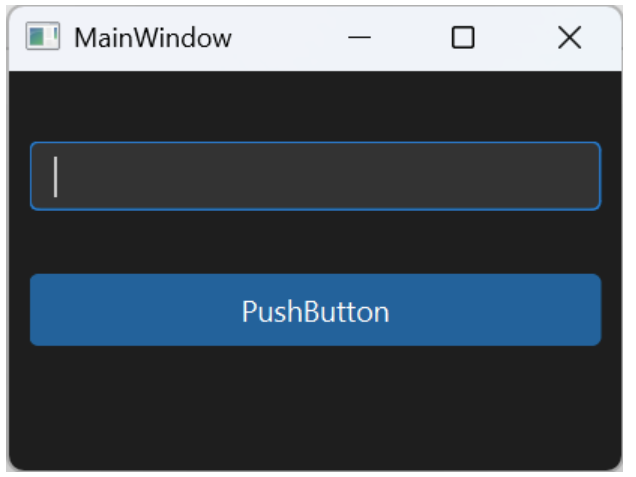
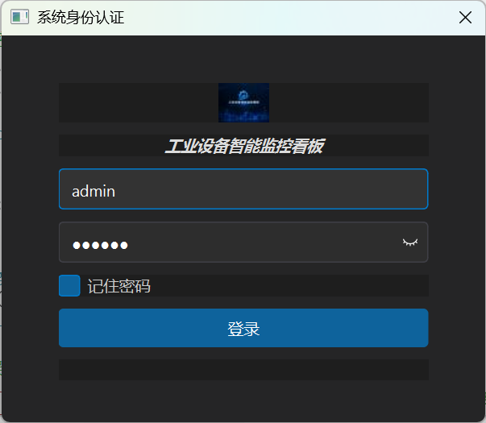
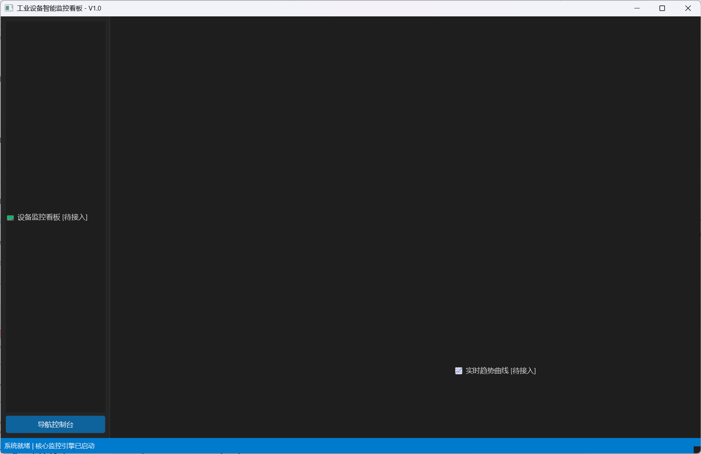
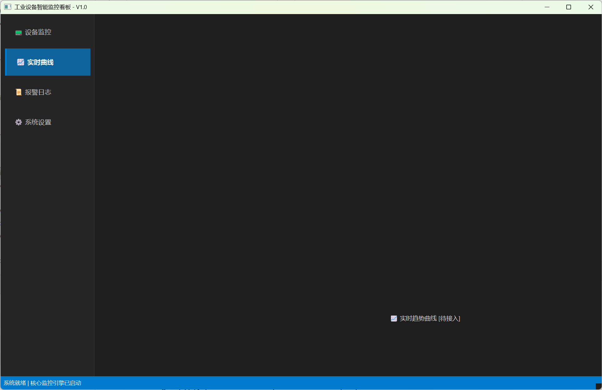

# IndustrialMonitor - V1 (工业设备智能监控看板)

一个基于 C++17 与 Qt 6 构建的现代化跨平台工业级设备监控看板系统。V1 阶段致力于确立规范的工控架构范式，摆脱传统初级控件堆砌，打造具备高视觉质感与毫秒级吞吐表现的 SCADA 监控原型。

## 📌 项目愿景
V1 阶段的目标是将系统从“基础窗口演示”打造为“工业级桌面客户端基座”。通过严格的架构解耦、规范的 MVC 模型视图设计和原生自绘技术，支撑起百级工业产线设备的状态实时呈现。
- **工业美学与低视疲劳**：自研深灰暗黑工业主题引擎，支持运行期热重载（Hot-Reload）。
- **极速响应 Model/View 架构**：基于 `QAbstractTableModel` 实现百万级虚拟化渲染吞吐，严禁使用卡顿的 `QTableWidget`。
- **原生像素级自绘**：通过 `QStyledItemDelegate` 与 `QPainter` 硬件加速绘制呼吸发光状态灯与动态性能进度条。
- **高信噪比检索**：基于 `QSortFilterProxyModel` 实现无感、实时的多条件模糊检索与列排序。

---

## 🛠 项目结构 (V1)
```text
IndustrialMonitor/
├── .gitignore
├── IndustrialMonitor.pro         # qmake 主工程配置文件（严格重定向产物路径）
├── bin/                          # 二进制输出目录（exe 产物与运行期目录）
│   ├── IndustrialMonitor.exe     # 编译生成的执行程序
│   └── config.ini                # [Day 2] 运行期生成的本地凭证与系统配置文件
├── build/                        # 构建临时目录（moc/obj/rcc/ui 统一隔离，不污染源码）
├── res/                          # 资源目录
│   ├── icons/                    # 系统状态图元与工业矢量图标
│   ├── qss/
│   │   └── dark_style.qss        # 核心工业暗黑配色样式表
│   └── res.qrc                   # Qt 二进制资源配置文件
└── src/                          # 核心源码目录
    ├── common/                   # 全局工具类、公共定义与主题管理器
    │   ├── ThemeManager.h
    │   └── ThemeManager.cpp
    ├── core/                     # 业务核心逻辑（后续迭代承载通信与数据泵）
    ├── models/                   # 核心 MVC 数据模型（QAbstractTableModel 派生）
    ├── views/                    # 界面视图（MainWindow、LoginDialog、自定义委托）
    │   ├── mainwindow.h
    │   ├── mainwindow.cpp        # [Day 4] 落地导航互斥组与 QMap 指针路由切页
    │   ├── mainwindow.ui         # [Day 4] 侧边栏按钮排版与底部弹簧
    │   ├── LoginDialog.h          # [Day 2] 工业登录弹窗头文件
    │   ├── LoginDialog.cpp        # [Day 2] 登录防呆与持久化逻辑
    │   └── LoginDialog.ui         # [Day 2] 登录弹窗布局文件
    └── main.cpp                  # 统一应用程序入口（生命周期拦截注入）
```

---

## 📅 进度跟踪 (V1 15天挑战)

### 第 1 阶段：工程规范、暗黑主题与主窗口骨架
- [x] **Day 01: 准备工作与工业级暗黑主题引擎 (ThemeManager)**
  - 实现编译产物完全隔离（`bin/` 与 `build/` 重定向）。
  - 建立物理分层源码架构（`src/`、`res/`、`views/` 等）。
  - 封装单例 `ThemeManager`，打通 `res.qrc` 资源打包与外部文件读取双机制。
  - 实现 `F5` 快捷键全局事件过滤器，支持 QSS 样式运行期免编译热重载。
- [x] **Day 02: 工业监控登录弹窗与免密凭证持久化 (LoginDialog & QSettings)**
  - 封装独立工业模态登录弹窗 `LoginDialog`，固定无拉伸工控比例（`400x320`）。
  - 使用 `QLineEdit::addAction` 实现尾部内嵌交互，支持密码明密文无缝切换。
  - 集成 `QSettings` 建立 `bin/config.ini` 持久化通道，实现凭证记住与启动自动回显。
  - 在 `main.cpp` 中建立阻断式生命周期（`exec() == Accepted`），拦截未授权启动。
- [x] **Day 03: 主窗口骨架与多页面堆叠布局 (MainWindow & QStackedWidget)**
  - 搭建工业标准“左侧固定导航栏 + 右侧多页工作区 + 底部状态栏”三段式拓扑。
  - 建立工业防挤压尺寸边界：锁定初始与最小安全尺寸 `1280 × 800`，侧边栏死锁 `200px`。
  - 清空中心部件边距与间隙（Margins 归零），消除视觉接缝。
  - 预设 `QStackedWidget` 4 大业务页面语义化占位，确立对象指针切页规范。
- [x] **Day 04: 动态侧边栏导航控制 (Navigation Binding)**
  - 封装 `QButtonGroup` 互斥状态机，全面开启按钮 `setCheckable(true)`。
  - 构建 `QMap<QAbstractButton*, QWidget*>` 纯指针映射路由，摆脱硬编码整数索引。
  - 侧边栏底部垫入 `Vertical Spacer` 弹性支撑，按钮高度锁定 `46px` 并设为 `Expanding`。
  - 精雕 QSS 常驻选中态（`:checked`），实现 `4px` 亮蓝边条与微光质感。
- [x] **Day 05: 工业状态栏与全域状态看板 (StatusBar)**
  - 封装底部高信噪比 `QStatusBar`：操作员标识、全局通信链路指示、高精度时钟。

### 第 2 阶段：侧边导航交互与专业 Model/View 架构
- [ ] **Day 06: 设备数据实体定义与页面搭建**
  - 定义 `DeviceInfo` 结构体与 `DeviceStatus` 状态枚举。
  - 构建设备监控首屏：顶部检索工具栏 + 核心展示容器。
- [ ] **Day 07: 打造专业级 QAbstractTableModel (只读基石)**
  - 继承 `QAbstractTableModel`，重写 `rowCount`、`columnCount`、`headerData`、`data`。
  - 建立只读高效虚拟数据通道，杜绝 `QTableWidget` 带来的内存膨胀。
- [ ] **Day 08: 数据填充与模型-视图 (Model-View) 联调**
  - 封装 `beginResetModel` / `endResetModel` 安全数据注入机制。
  - 接入整行高亮选中、交替行底色、表头自动伸缩等工业交互特性。
- [ ] **Day 09: 搜索过滤与平滑排序 (QSortFilterProxyModel)**
  - 引入代理模型（ProxyModel）实现数据展示层与逻辑层的三层解耦。
  - 连接文本变化信号，毫秒级实现 IP 地址与设备名称的多列正则过滤。
- [ ] **Day 10: 性能基准测试与百万行加载压测**
  - 测试虚拟列表内存占用与滚动吞吐帧率，建立工业级响应标准。

### 第 3 阶段：自定义委托绘制、交互精雕与里程碑发布
- [ ] **Day 11: 自定义委托（绘制工业三色呼吸状态指示灯）**
  - 实现 `StatusDelegate`（继承自 `QStyledItemDelegate`）。
  - 基于 `QPainter` 抗锯齿渲染发光点阵（正常绿、预警黄、故障红、离线灰）。
- [ ] **Day 12: 自定义委托（单元格内嵌微型性能进度条）**
  - 编写 `ProgressBarDelegate` 接管 CPU 与内存指标列。
  - 注入动态区间变色算法（<60% 正常绿，60%~85% 告警黄，>85% 危险绯红）。
- [ ] **Day 13: 滚动条精雕与全域视觉统一**
  - 精细化暗黑高质感滚动条（细条悬停加粗、凹槽无边框融合）。
  - 修正所有子窗体焦点游离与边缘像素瑕疵。
- [ ] **Day 14: 内存巡检与生命周期防御**
  - 全工程内存排查，规范 Qt 父子对象树（Object Tree）所有权归属。
  - 修复全部隐式数据类型转换与潜在内存泄漏点。
- [ ] **Day 15: 里程碑封版与代码重构 (v0.1-Alpha)**
  - 规范 Doxygen 风格注释，打包独立运行所需依赖库。
  - 封版并标记 Git Tag：`v0.1-Alpha`。

---

## 🚀 Day 01 进展：工程规范架构与暗黑主题引擎

### 1. 技术核心：构建隔离与动态热重载体系
为避免工控桌面应用在开发迭代中陷入“目录杂乱”与“样式微调重启耗时”的死循环，Day 01 建立了标准化防线：
- **产物彻底隔离 (Out-of-Source Layout)**：
  - 通过 `.pro` 配置 `DESTDIR = $$PWD/bin`，将生成的目标可执行文件收敛至 `bin/`。
  - 将所有中间文件（`moc_*.cpp`、`*.o`、`ui_*.h`、`qrc_*.cpp`）全部分流至 `build/` 下的独立子目录。
- **全局事件过滤热重载 (Hot-Reload via EventFilter)**：
  - 将 `ThemeManager` 挂载为单例，并为 `qApp` 安装事件过滤器（`installEventFilter`）。
  - 捕获 `Qt::Key_F5` 按键事件，动态重载外部 QSS 样式表，免去了频繁重新编译界面的机械动作。

### 2. 开发复盘：Day 01 攻克的构建与链接血泪史

#### **陷阱 A: 大小写不敏感引发的 Duplicate Symbols (链接期死锁)**
- **现象**：MinGW 报出大量 `multiple definition of 'ThemeManager::...'` 错误，指向 `ThemeManager.o` 与 `thememanager.o`。
- **根因**：Windows 操作系统不区分大小写，而在 `IndustrialMonitor.pro` 中，`SOURCES` 同时包含了 `ThemeManager.cpp` 和 `thememanager.cpp`。Makefile 针对不同大小写生成了两套目标构建规则，导致同一个物理源文件被链接器编译了两次。
- **解决**：清理 `.pro` 中的冗余条目，强制统一使用 PascalCase（大驼峰）命名，并彻底抹除旧的编译残留。

#### **陷阱 B: Q_OBJECT 元对象虚表缺失 (`undefined reference to vtable`)**
- **现象**：类继承自 `QObject` 并加入了 `Q_OBJECT` 宏，但构建直接中断并报错虚表未定义。
- **根因**：头文件移动了物理位置（从根目录移至 `src/common/`）后，qmake 的依赖图谱未更新，导致元对象编译器（`moc`）跳过了对新路径下 `ThemeManager.h` 的代码生成。
- **解决**：在工程结构发生物理迁移后，必须**手动执行一次 qmake**，强制让 moc 建立最新的依赖映射。

#### **陷阱 C: 运行时工作路径与虚拟资源前缀漂移**
- **现象**：界面正常弹出，但依然是 Windows 亮白默认样式，QSS 样式完全未渲染。
- **根因**：由于配置了 `DESTDIR = $$PWD/bin`，程序的执行目录位于 `bin/`，直接通过相对路径 `"res/qss/..."` 会导致文件读取失败；同时，`res.qrc` 内部的虚拟前缀与实际相对路径存在层级偏差。
- **解决**：将路径规范化为 Qt 内置资源定位器形式（`:/qss/dark_style.qss`），并确保 `res.qrc` 相对于文件自身的映射层级准确无误。

### 3. 如何验证
1. **工程结构干净度验证**：
   - 执行清理并重新编译，确认源码树中无任何中间物，`bin/` 产出独立运行文件，`build/` 收容所有对象文件。
2. **工业暗黑调色盘验收**：
   - 运行程序，主视口成功染上 `#1E1E1E` 工业哑光深灰底色。
   - 输入框呈现 `#2D2D2D` 容器底色并伴有高亮边框；按钮展示 `#0E639C` 经典工控蓝，悬停变色平滑过渡。

**Day 01 运行快照：**



```text
[ThemeManager] Theme loaded successfully from: ":/qss/dark_style.qss"
[ThemeManager] Global Hot-Reload EventFilter installed (F5 Active).
```

---

## 🚀 Day 02 进展：工业登录弹窗与免密凭证持久化 (LoginDialog & QSettings)

### 1. 技术核心：阻断式生命周期与复合输入控件
作为工控系统的安全准入屏障，Day 02 完成了从“UI 交互”到“底层凭证管理”的闭环：
- **模态生命周期阻断 (Modal Blocking in main.cpp)**：
  - 弃用传统的窗体并存模式，利用 `LoginDialog::exec()` 挂起局部事件循环。
  - 只有校验成功触发 `accept()` 时才返回 `QDialog::Accepted` 并实例化主视窗；非法关闭或退出直接 `return 0` 终结进程，杜绝未授权穿透。
- **内嵌 Action 复合输入框 (Trailing Action)**：
  - 采用 `QLineEdit::addAction(action, QLineEdit::TrailingPosition)`，实现类似现代 Web/桌面端的原生内嵌明密文切换按钮。
  - 点击动态切换 `echoMode()`（`Password` 与 `Normal`），避免额外堆叠孤立的显隐按钮。
- **轻量化配置持久化引擎 (QSettings)**：
  - 使用跨平台 INI 格式驱动 `bin/config.ini`，实现密码 Base64 简易混淆与“记住密码”状态自动还原。

### 2. 开发复盘：Day 02 攻克的 UI 约束与交互陷阱

#### **陷阱 A: 浮动布局失效与控件无法自适应 (顶层布局缺失)**
- **现象**：使用 `QHBoxLayout` 排版 Logo 与标题后，控件在设计器中呈现不可伸展的漂浮状态，对象树出现红色禁用图标，控件无法随窗口缩放。
- **根因**：直接在画布上框选控件生成的布局是游离的（Floating Layout），父容器 `LoginDialog` 缺少全局顶层布局管理器。
- **解决**：右键点击 Dialog 空白区域设置“垂直布局”（Lay out Vertically），确立顶层 `QVBoxLayout`；并精确调整子控件的 `sizePolicy`（Label 设为 `Expanding`，Button 限制最大宽度），彻底解决排版塌陷。

#### **陷阱 B: 运行时工作目录漂移导致的 INI 文件“迷路”**
- **现象**：通过 IDE 调试运行时配置写入正常，但在双击快捷方式或不同工作目录下启动时，无法回显凭证。
- **根因**：使用 `QSettings("config.ini", ...)` 会依赖当前工作目录（Working Directory），易随启动环境偏移。
- **解决**：使用绝对物理锚定：`QCoreApplication::applicationDirPath() + "/config.ini"`，确保配置必定落入 `bin/config.ini`。

#### **陷阱 C: 动态错误提示导致的布局剧烈跳动 (Layout Shift)**
- **现象**：当验证失败显示错误信息时，下方登录按钮被突兀下压；清空错误时按钮又向上弹跳。
- **解决**：放弃 `lblErrorHint->hide()` 的粗暴做法，将其在布局中赋予固定的占位高度（`fixedHeight: 18px`），初始赋值为空文本 `""`。即使报错变色也始终维持视觉空间的恒定。

### 3. 如何验证
1. **模态阻断与安全退出测试**：
   - 启动程序，仅弹出 `400x320` 工业深色登录窗，后台主窗体处于休眠未构建状态。
   - 直接点击右上角关闭，进程立即安全终结退出。
2. **防呆与明密文交互测试**：
   - 空账号/密码点击登录，界面居中显现红色警告文字“⚠️ 用户名或密码不可为空！”，无多余系统弹窗打扰。
   - 输入密码后点击尾部“👁”图标，密码瞬间在密文点阵与明文之间平滑切换。
3. **免密凭证持久化闭环**：
   - 输入 `admin` / `123456` 并勾选“记住密码”，点击登录成功进入主窗口。
   - 检查 `bin/config.ini`，确认生成 `[Auth]` 分区及对应 Base64 编码数据。
   - 重启程序，凭证已自动填入输入框，直接回车即可畅通登入。

**Day 02 运行快照：**



```ini
# bin/config.ini 运行期持久化快照
[Auth]
RememberMe=true
Username=admin
Password=MTIzNDU2
```

---

## 🚀 Day 03 进展：主窗口骨架与多页面堆叠布局 (MainWindow & QStackedWidget)

### 1. 技术核心：工控拓扑骨架与单窗口多视图容器
作为工业监控软件的视口中枢，Day 03 确立了工控桌面的物理空间骨架：
- **工控“左导右表”三段式拓扑**：
  - **左侧导航栏 (`sidebarWidget`)**：设定水平尺寸死锁（`setFixedWidth(200)`），无论主窗体如何剧烈缩放，导航基线永不形变。
  - **右侧工作区 (`contentWidget` + `QStackedWidget`)**：设置最高拉伸优先级（`Expanding`），承载所有核心业务。
  - **底部状态栏 (`QStatusBar`)**：固定 `28px` 高度，为全域指示灯与时钟保留工业级底栏通道。
- **语义化单窗口多页面机制 (QStackedWidget)**：
  - 在堆叠容器中预置 4 个语义化子页面（`pageMonitor`、`pageTrend`、`pageAlarm`、`pageSetting`），每个子页独立配置垂直布局，杜绝子控件漂浮。
  - 抛弃易引起越界和顺序错乱的整型索引切页（`setCurrentIndex`），确立基于对象指针的工业切页规范（`setCurrentWidget(ui->pageMonitor)`）。
- **防挤压尺寸边界与无缝贴合**：
  - 硬性设定最小安全分辨率 `1280 × 800`，杜绝工业显示屏低分辨率下控件重叠折叠。
  - 全局清空中心部件的布局边距（`ContentsMargins: 0`）与控件间距（`Spacing: 0`），消除任何视觉杂缝。

### 2. 开发复盘：Day 03 攻克的时序与视图认知陷阱

#### **陷阱 A: 控件初始化时序颠倒引发的空指针闪退 (Segmentation Fault)**
- **现象**：在 `MainWindow` 构造函数中编写边距清理代码 `if (ui->centralWidget->layout())` 时，程序刚启动即触发 `0xC0000005` 崩溃闪退。
- **根因**：代码写在了 `ui->setupUi(this)` **之前**。Qt 的界面指针只有在 `setupUi` 执行完毕后才被实例化；在其实例化前访问 `ui->...` 属于典型的野指针解引用。此外，Qt 原生默认生成的对象名全小写为 `centralwidget`（注意 `w` 小写）。
- **解决**：明确“先 `setupUi` 后操作控件”的绝对铁律；并改用 `this->centralWidget()` 原生方法双重安全判空，或直接在 Qt Designer 属性面板中将 Margin 归零，彻底消灭运行时风险。

#### **陷阱 B: QStackedWidget 无头容器的认知厘清**
- **现象**：暗黑主题应用后，运行程序发现 `stackedWidget` 右上角原本在设计器里可见的翻页按钮全部消失，误以为是被深色样式覆盖。
- **根因**：`QStackedWidget` 在运行时是一个“无头（Headless）”代码驱动容器，设计器右上角的小箭头仅是用于编辑预览的辅助图元，运行时本身就没有任何自带 Tab 按钮。
- **解决**：明确组件分工——`QStackedWidget` 负责页面容器静默管理，外部切换统一由明日的左侧侧边栏按钮（信号槽）驱动。

#### **陷阱 C: 对象树字母排序与切页鲁棒性**
- **现象**：Qt Designer 对象树开启默认字母升序后，页面展示顺序变为 `pageAlarm` -> `pageMonitor` -> `pageSetting` -> `pageTrend`，引起页面索引与业务顺序脱节的疑虑。
- **根因**：对象树的排序仅为 IDE 视图的可视化组织，绝不更改内部真实的构建顺序与物理内存。
- **解决**：采用指针级驱动 `setCurrentWidget(ui->pageMonitor)`，代码完全与数值索引（Index 0/1/2/3）解耦，无论对象树如何重排，切页逻辑永远绝对命中。同时为每个 Page 补齐顶级布局，消除对象树上的红色未布局禁用标（🚫）。

### 3. 如何验证
1. **登录联动唤醒验证**：
   - 登录框输入 `admin` / `123456`，按回车通过校验。
   - 登录框平滑销毁，`1280 × 800` 工业深色主视窗瞬间在屏幕中央激活展开。
2. **响应式缩放与防挤压测试**：
   - 鼠标强行向内收缩主窗体，到达 `1280 × 800` 边界时被刚性拦截，无法进一步压缩。
   - 双击标题栏最大化铺满屏幕，左侧导航栏宽度纹丝不动保持 `200px`，右侧核心工作区无缝平滑延展。
3. **堆叠容器指针切页验证**：
   - 构造函数调用 `ui->stackedWidget->setCurrentWidget(ui->pageMonitor);`，右侧稳定呈现“📟 设备监控看板”占位信息。
   - 修改为 `ui->pageTrend` 并热重载，内容秒级无抖动切换，证明容器与各子页独立布局运转正常。

**Day 03 运行快照：**



```text
[MainWindow] Initialization complete. Geometry: 1280x800.
[MainWindow] Sidebar locked at 200px.
[MainWindow] StackedWidget initialized with 4 semantic pages (Default: pageMonitor).
[StatusBar] Ready: "系统就绪 | 核心监控引擎已启动"
```

---

## 🚀 Day 04 进展：动态侧边栏导航控制与互斥路由 (Navigation & QButtonGroup)

### 1. 技术核心：单选互斥状态机与指针路由解耦
作为串联主工作区多视窗的中枢神经，Day 04 落地了工业标准的侧边栏导航控制机制：
- **`QButtonGroup` 统一状态托管**：
  - 将侧边栏 4 个导航按钮编入 `m_navigationGroup`，开启 `setExclusive(true)` 强互斥锁。
  - 为按钮开启 `setCheckable(true)` 双稳态，彻底告别传统写多个 `connect` 手动清除其他按钮高亮的冗余代码。
- **纯指针解耦路由 (`QMap<QAbstractButton*, QWidget*>`)**：
  - 弃用传统的 `switch(index)` 或硬编码数字，建立按钮实例到目标页面的强类型指针映射。
  - 单一信号槽响应 `buttonClicked`，通过 `m_pageMap[btn]` 毫秒级分发跳转，页面顺序无论后期如何重组均坚如磐石。
- **弹性布局与大点击热区规范**：
  - 在侧边栏纵向布局底部植入 `Vertical Spacer`（垂直弹簧），将导航按钮死死压向顶部停靠，杜绝全屏缩放时按钮被纵向离散拉扯。
  - 按钮高度严格锁定为工控大热区 `46px`，水平尺寸策略赋予 `Expanding`，无感撑满侧边栏宽度。

### 2. 开发复盘：Day 04 攻克的指针生命周期与尺寸约束陷阱

#### **陷阱 A (核心血泪史): 悬空指针噩梦——声明了指针却遗漏 `new QButtonGroup(this)`**
- **现象**：编写完导航初始化逻辑后，程序进入主窗口的瞬间直接触发 `0xC0000005` 段错误（Access Violation）闪退。
- **断点定位**：排查发现程序崩溃精准发生在循环体的第一步：
  ```cpp
  for (auto *btn : m_navBtn) {
      m_navigationGroup->addButton(btn); // 💥 瞬间崩溃在此处！
  }
  ```
- **根因深剖**：
  - 在 `mainwindow.h` 中，我们声明了成员变量：`QButtonGroup *m_navigationGroup;`。
  - **在 C++ 中，指针声明后不会自动分配内存！** 它的初始值是一个随机的垃圾地址（Wild Pointer 野指针）或是 `nullptr`。
  - 由于未在构造函数或初始化函数中对其执行 `new` 实例化，代码直接执行 `m_navigationGroup->addButton(btn)`，相当于对一个虚无的内存地址发起成员函数调用，操作系统内核立即下发段错误中断进程。
- **解法与 Qt 对象树（Object Tree）生命周期防御**：
  - **解决之道**：在调用前必须先落地堆内存分配：
    ```cpp
    m_navigationGroup = new QButtonGroup(this); // 传入 this 确立父子所有权
    ```
  - **为什么析构函数绝不需要手动 `delete m_navigationGroup`？**
    * 当传入 `this`（即 `MainWindow`）时，`m_navigationGroup` 就被挂载到了 Qt 的**底层父子对象树（Object Tree）**上。
    * 当 `MainWindow` 窗口关闭析构时，Qt 底层会自动遍历其 `children()` 列表，安全调用 `delete` 释放所有子对象。
    * **结论**：只要在 `new` 时传入了 `this` 父指针，不仅彻底终结了野指针风险，而且由 Qt 框架全权接管生命周期，零内存泄漏，**在析构函数里手动写 `delete` 反而是画蛇添足的危险行为**！

#### **陷阱 B: 布局内尺寸约束误区——寻找 `setWidth` 与死锁宽度的弊端**
- **认知纠偏**：Qt 的 `QWidget` 根本没有 `setWidth()` 函数；若试图调用 `setFixedWidth(200)` 把按钮宽度写死，会彻底破坏布局系统的弹性。
- **工程解法**：由于父容器 `sidebarWidget` 已锁死为 `200px`，只需调用 `btn->setSizePolicy(QSizePolicy::Expanding, QSizePolicy::Fixed)` 与 `btn->setFixedHeight(46)`，按钮即可自动贴合父容器的宽度；同时把 `sidebarWidget` 的布局外边距清零（`setContentsMargins(0, 0, 0, 0)`），使按钮与左侧边框无缝贴合。

#### **陷阱 C: 侧边栏常驻高亮失焦恢复的排查**
- **现象**：点击导航按钮后虽然变色，但点击右侧工作区任意空白后，选中的按钮底色变灰退回普通态。
- **解决**：在 QSS 中精准使用 `:checked` 伪类（而非 `:focus` 伪类）。`:focus` 会随点击转移而丢失，而 `:checked` 由 `QButtonGroup` 互斥状态机硬性维持，结合 `border-left: 4px solid #007ACC;`，完美实现了工控软件常驻发光指示条质感。

### 3. 如何验证
1. **互斥单选与常驻高亮测试**：
   - 登录进入系统，默认“📟 设备监控”按钮亮起深蓝底色并展示左侧 4px 亮蓝竖条。
   - 点击“📈 实时曲线”，“设备监控”按钮高亮秒级熄灭退回暗灰底色，“实时曲线”按钮即刻点亮。
   - 鼠标点击右侧工作区任意空白处使侧边栏失去键盘/鼠标焦点，**断言**：当前选中的按钮依然高亮锁定，绝不退色。
2. **指针路由秒切视窗测试**：
   - 连续快速点击“报警日志”与“系统设置”，右侧 `QStackedWidget` 内容以 <1ms 的无感速度精准切换为对应子页面，无任何闪烁白屏或错位。
3. **窗口剧烈缩放自适应**：
   - 双击标题栏全屏最大化，左侧 4 个导航按钮紧凑聚集在顶部，高度恒定 46px；下方垂直弹簧平滑吸收垂直方向全部拉伸空间，排版毫无变形。

**Day 04 运行快照：**


```text
[Navigation] Group initialized with 4 buttons. Exclusive mode: ON.
[Router] PageMap registered:
  - btnMonitor -> page01Monitor (Active)
  - btnTrend   -> page02Trend
  - btnAlarm   -> page03Alarm
  - btnSetting -> page04Setting
[Switch] Switched to page: page01Monitor
```

---
以下是专门为你整理的 **Day 05 独立 README 记录**，去除了图片依赖，深度还原了今天排查的两大经典底层陷阱：

---

## 🚀 Day 05 进展：工业状态栏引擎与全域通信状态监控 (QStatusBar & QTimer)

### 1. 技术核心：全域感知底栏与动态时钟引擎
作为工业监控看板的时空基准与通信健康度中枢，Day 05 落地了模块化的工业底栏引擎：
- **三段式分区与常驻隔离机制**：
  - **左侧普通交互区 (`addWidget(..., 1)`)**：挂载操作员凭证（`m_labelOperator`），赋予弹性拉伸权重 `1`。当外部触发 `showMessage()` 临时告警时，此区域自动让渡展示，倒计时结束后无缝复原。
  - **中间通信指示区 (`addPermanentWidget`)**：封装链路组合部件（10x10 发光球体 + 状态说明文字），拥有永久常驻权，绝不被临时消息顶替。
  - **右侧高精度时钟区 (`addPermanentWidget`)**：基于 `QTimer` 1000ms 轮询更新 `yyyy-MM-dd HH:mm:ss`，固定 `190px` 宽度并采用等宽字体（Consolas），彻底消除数字秒数跳变引发的界面横向微颤（Anti-Jitter）。
- **纯 QSS 像素级圆形发光指示灯**：
  - 弃用外部图片资源，纯粹基于 `border-radius: 5px` 与高对比边框渲染四态微光指示灯（Normal 荧光绿 `#00E676`、Warning 亮黄 `#FFD600`、Fault 绯红 `#FF1744`、Offline 灰 `#757575`）。
  - 基于 Qt 动态属性机制（`setProperty("status", ...)`）驱动样式表热切换。

---

### 2. 开发复盘：Day 05 攻克的状态栏区域抢占与动态样式陷阱

#### **陷阱 A: 永久部件挤压与时钟时序陷阱——为什么 `showMessage` 会凭空隐形？**
- **现象**：调用 `statusBar()->showMessage("正在同步设备数据...", 3000)` 后，底栏文字始终纹丝不动，依然只显示操作员信息，临时消息毫无反应。
- **根因深度排查**：
  1. **区域权重踩踏**：起初错误地调用了 `addPermanentWidget(m_labelOperator, 1)`。在 Qt 机制中，`addPermanentWidget` 会被强制排布在右侧的永久区，给其设置权重 `1` 导致永久区把整个底栏空间彻底占死，左侧本应属于 `showMessage` 的临时消息区被**挤压成了 0 宽度**；同时永久部件拥有绝对豁免权，`showMessage` 无法将其隐藏，导致临时消息彻底被遮蔽。
  2. **构造函数超时时序**：在构造函数执行 `showMessage(..., 3000)` 时，3000ms 定时器在窗口真正完成渲染弹出前就已在底层跑满或超时结束，导致肉眼以为未显示。
  3. **历史代码覆盖**：前期代码 `initLayout()` 中遗留的 `showMessage("系统就绪...", 0)` 以无超时参数直接顶替了后续的消息。
- **解决方案**：
  - 左侧严格使用 `statusBar()->addWidget(m_labelOperator, 1)` 挂载；中间与右侧组件使用 `addPermanentWidget`。
  - 明确工控使用场景：`showMessage` 不应写死在构造期，而应作为按钮点击（如 `btnRefresh`）或异步通讯反馈时的即时通知通道。

#### **陷阱 B: 变量名手误致使 QSS 动态属性赋错对象——指示灯“不亮”之谜**
- **现象**：`setLinkStatus(LinkStatus::Normal, ...)` 调用后，链路文字正常更新，但前方的 10x10 小圆点指示灯始终是透明不可见的，QSS 样式完全未渲染。
- **排查过程**：
  - 单独为指示灯设置内联样式 `setStyleSheet("background-color: green;")` 时，圆点可以正常显现，证明布局与尺寸无问题。
  - 最终在 `setLinkStatus` 的实现中捕获到了致命手误：
    ```cpp
    m_labellLinkStatus->setProperty("status", statusVal); // ❌ 设错对象！将 status 属性挂到了后面的文本标签上
    m_labelLinked->style()->unpolish(m_labelLinked);      // 刷新的却是前面的小圆点指示灯
    m_labelLinked->style()->polish(m_labelLinked);
    ```
- **机制原理**：
  - `m_labelLinked` 自身根本没有拿到 `status="normal"` 属性，导致 QSS 选择器 `QLabel#linkLed[status="normal"]` 判定未命中，指示灯维持默认透明。
  - 同时再次印证了 Qt 的经典机制：**修改 `setProperty` 后，Qt 不会自动刷新样式引擎**，必须显式调用 `style()->unpolish(widget)` 和 `style()->polish(widget)` 强刷重绘。
- **解决方案**：纠正变量为 `m_labelLinked->setProperty("status", statusVal);`，小圆点荧光绿高光瞬间点亮。

---

### 3. 如何验证
1. **秒级时钟稳定防抖测试**：
   - 登录进入系统，底栏右侧立即显现当前年月日与高精度秒数。
   - 观察数字从 `1` 跳变至 `8`，右侧时钟由于预留了 `190px` 空间及 Consolas 等宽字体，**整条状态栏无任何横向抽搐或抖动**。
2. **三色呼吸灯状态切换测试**：
   - 启动时自动初始化为 `Normal` 态，呈现荧光绿微光圆点。
   - 代码中切换至 `Warning`、`Fault` 或 `Offline`，指示灯秒级变黄/变红/变灰，文字提示即时同步。
3. **临时消息动态穿透与复原测试**：
   - 点击界面刷新按钮，触发 `statusBar()->showMessage("🔄 正在向底层 PLC 刷新同步设备数据...", 2000)`。
   - **断言**：左侧 `👤 操作员: admin` 瞬间被冲刷替换为刷新提示，右侧通信绿灯与时钟丝毫不受干扰；2 秒后提示文字自动隐去，操作员标签平滑恢复原位。

---

### 4. 运行快照（控制台与日志状态）

```text
[StatusBar] Initialized:
  - Left Zone     : [Normal Widget] m_labelOperator (Stretch: 1)
  - Center Zone   : [Permanent Widget] linkWidget (LED: linkLed, Status: Normal)
  - Right Zone    : [Permanent Widget] m_labelClock (190px, Monospace)
[ClockTimer] Started (Interval: 1000ms). Initial timestamp: 2026-09-14 10:24:00
[LinkStatus] Property updated -> Target: linkLed, Status: "normal", Text: "通信链路: 在线 (10ms)"
[DynamicFeedback] Temporary message displayed: "🔄 正在向底层 PLC 刷新同步设备数据..." (Duration: 2000ms)
[DynamicFeedback] Timeout reached -> Operator label restored smoothly.
```
---

## 💻 编译与运行
- **开发套件**：Qt 6.8+ (MinGW 64-bit)
- **构建步骤**：
  1. 使用 Qt Creator 打开根目录下的 `IndustrialMonitor.pro`。
  2. 点击左侧工具栏 **“构建” -> “执行 qmake”**。
  3. 点击左下角 **运行 (Ctrl + R)** 即可启动监控看板原型。